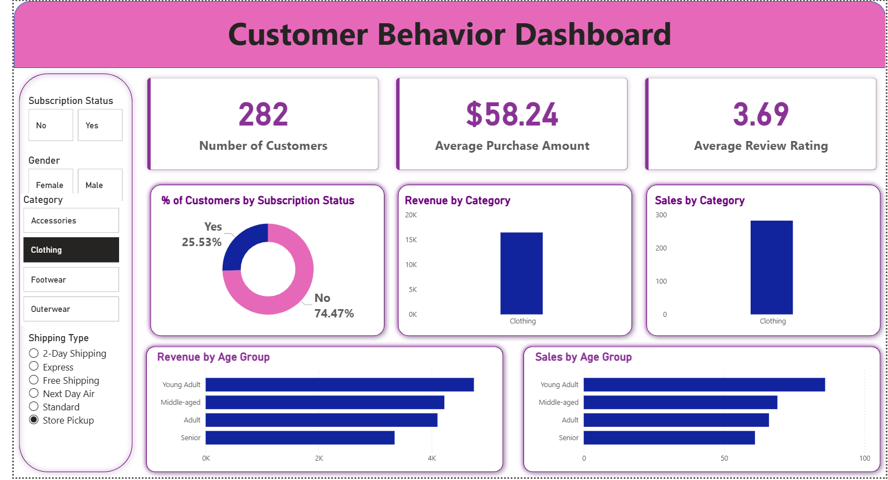

Customer Behaviour Analysis 📊

A complete Data Analytics Project focused on analyzing customer purchasing behavior in the retail/e-commerce domain using Python, SQL Server, and Power BI.

📌 Project Overview

This project helps retail businesses understand customer behavior patterns to improve:

Customer retention
Revenue generation
Marketing strategies
Product demand analysis
Customer segmentation
The project includes:
Data Cleaning & Preprocessing using Python
Exploratory Data Analysis (EDA)
SQL-based Business Insights
Interactive Power BI Dashboard
🛠️ Tech Stack
Python
Pandas
NumPy
SQLAlchemy
PyODBC
SQL Server
Data storage
Business analysis queries
Power BI
Dashboard creation
Visualization & reporting
📂 Dataset Information
Dataset Type

Retail / E-commerce Dataset

Data Structure

Structured (Tabular)

Key Features
Column Name	Description
Customer ID	Unique customer identifier
Age	Customer age
Gender	Male/Female/Other
Item Purchased	Product purchased
Category	Product category
Purchase Amount	Amount spent
Season	Season of purchase
Review Rating	Product rating
Discount Applied	Discount usage
Payment Method	Payment mode
Previous Purchases	Past purchase count
Frequency of Purchases	Buying frequency
🔍 Business Problems Solved
Identify high-value customers
Analyze purchase behavior
Understand discount effectiveness
Find top-performing categories/products
Study payment method trends
Analyze seasonal demand
Segment customers based on loyalty
🧹 Data Cleaning & Preprocessing
✔️ Steps Performed
Data loading using Pandas
Missing value handling
Category correction using mapping
Duplicate removal
Column standardization
Data export to SQL Server
Missing Value Handling Logic
Column	Method Used
Size	Category-wise filling
Review Rating	Product-level mean
Purchase Amount	Mean imputation
Previous Purchases	Filled with 0

📊 Exploratory Data Analysis (EDA)

Performed detailed EDA to understand:

Customer demographics
Spending patterns
Category performance
Seasonal sales trends
Discount behavior
Subscription impact
🗄️ SQL Analysis Questions

Some important business questions solved using SQL:

Which category generates the highest revenue?
Do discounts increase purchase value?
Revenue contribution by gender
Top & bottom rated products
Shipping type comparison
Subscriber vs Non-subscriber spending
Top discounted products
Customer segmentation analysis
Top products within each category
Revenue contribution by age group
📈 Power BI Dashboard

The dashboard includes:

Revenue KPIs
Customer segmentation visuals
Category-wise sales analysis
Seasonal trends
Discount impact analysis
Payment method insights
🚀 Project Workflow
Raw Dataset
     ↓
Python Data Cleaning
     ↓
EDA using Pandas
     ↓
SQL Server Analysis
     ↓
Power BI Dashboard
     ↓
Business Insights
📷 Project Screenshots

Add your Power BI dashboard screenshots here

Example:

📁 Project Structure
Customer-Behaviour-Analysis/
│
├── Dataset/
├── Python Scripts/
├── SQL Queries/
├── Power BI Dashboard/
├── Images/
└── README.md
🎯 Key Insights
Discount campaigns influence purchase behavior
Loyal customers generate higher revenue
Seasonal trends impact sales significantly
Subscription users spend more on average
Certain product categories dominate revenue
📚 Learning Outcomes

Through this project, I learned:

Real-world data cleaning techniques
Business-focused EDA
SQL analytical queries
Dashboard design in Power BI
Customer segmentation analysis
👨‍💻 Author

Shrikant Jarande

GitHub: https://github.com/shrikanttt2901/Customer-Behavior-Data-Analyst-Portfolio-Project/edit/main/README.md
 
LinkedIn Link
